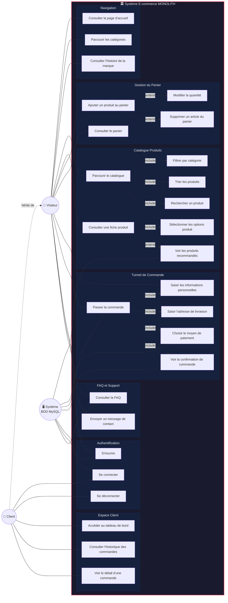

# Diagramme de Cas d'Utilisation — MONOLITH E-commerce

## Acteurs

| Acteur | Description |
|--------|-------------|
| **Visiteur** | Utilisateur non authentifié naviguant sur le site |
| **Client** | Utilisateur authentifié (hérite du Visiteur) |
| **Système BDD** | Système de gestion MySQL (sessions, paiements, recommandations, FAQ) |

---

## Diagramme UML

---

## Détail des cas d'utilisation

### 🏠 Navigation

| ID | Cas d'utilisation | Acteur | Description |
|----|-------------------|--------|-------------|
| UC1 | Consulter la page d'accueil | Visiteur | Affiche le hero, les catégories bento grid, les bestsellers et la citation |
| UC2 | Parcourir les catégories | Visiteur | Navigation via la grille de catégories vers le catalogue filtré |
| UC3 | Consulter l'histoire de la marque | Visiteur | Page Notre Histoire `/story` |

### 🛍️ Catalogue Produits

| ID | Cas d'utilisation | Acteur | Description |
|----|-------------------|--------|-------------|
| UC4 | Parcourir le catalogue | Visiteur | Liste des produits actifs `/products` |
| UC5 | Filtrer par catégorie | Visiteur | Filtre via `?category=slug` — include de UC4 |
| UC6 | Trier les produits | Visiteur | Tri par prix asc/desc, nom — include de UC4 |
| UC7 | Rechercher un produit | Visiteur | Recherche par nom/description `?search=` — include de UC4 |
| UC8 | Consulter une fiche produit | Visiteur | Détail avec image, prix, description, options `/products/:id` |
| UC9 | Voir les produits recommandés | Système | Recommandations basées sur `product_recommendations` — extend de UC8 |
| UC10 | Sélectionner les options | Visiteur | Choix taille/couleur via `option_groups` et `option_values` — include de UC8 |

### 🛒 Gestion du Panier

| ID | Cas d'utilisation | Acteur | Description |
|----|-------------------|--------|-------------|
| UC11 | Ajouter au panier | Visiteur | POST `/cart/add` avec produit, quantité et options sélectionnées |
| UC12 | Modifier la quantité | Visiteur | POST `/cart/update` — extend de UC11 |
| UC13 | Supprimer un article | Visiteur | POST `/cart/remove` — extend de UC11 |
| UC14 | Consulter le panier | Visiteur | Affichage panier en session avec total `/cart` |

### 💳 Tunnel de Commande

| ID | Cas d'utilisation | Acteur | Description |
|----|-------------------|--------|-------------|
| UC15 | Saisir infos personnelles | Visiteur | Prénom, nom, email — include de UC18 |
| UC16 | Saisir adresse de livraison | Visiteur | Adresse, département, pays — include de UC18 |
| UC17 | Choisir le paiement | Visiteur, Système | CB, PayPal ou Virement — include de UC18 |
| UC18 | Passer la commande | Visiteur, Système | POST `/checkout/place-order` crée commande, items, paiement |
| UC19 | Voir la confirmation | Visiteur, Système | Page de succès avec récapitulatif `/checkout/success/:id` — include de UC18 |

### 🔐 Authentification

| ID | Cas d'utilisation | Acteur | Description |
|----|-------------------|--------|-------------|
| UC20 | S'inscrire | Visiteur, Système | POST `/auth/register` hash bcrypt, création session |
| UC21 | Se connecter | Client, Système | POST `/auth/login` vérification email/password |
| UC22 | Se déconnecter | Client | GET `/auth/logout` destruction de session |

### 📊 Espace Client

| ID | Cas d'utilisation | Acteur | Description |
|----|-------------------|--------|-------------|
| UC23 | Accéder au tableau de bord | Client | Dashboard protégé par middleware `isAuthenticated` `/dashboard` |
| UC24 | Consulter l'historique | Client | Liste des commandes avec statut pending/paid/canceled |
| UC25 | Voir le détail d'une commande | Client | Détails items et images `/dashboard/order/:id` |

### ❓ FAQ et Support

| ID | Cas d'utilisation | Acteur | Description |
|----|-------------------|--------|-------------|
| UC26 | Consulter la FAQ | Visiteur, Système | FAQ dynamique par catégories depuis `faq_categories` / `faq_questions` |
| UC27 | Envoyer un message | Visiteur | POST `/contact` sauvegarde dans `contact_messages` |

---

## Relations entre cas d'utilisation

### Relations include (obligatoires)
- **UC4** → UC5, UC6, UC7 — le catalogue inclut filtrage, tri et recherche
- **UC8** → UC10 — la fiche produit inclut la sélection d'options
- **UC18** → UC15, UC16, UC17, UC19 — passer commande inclut les étapes du tunnel

### Relations extend (optionnelles)
- **UC8** ← UC9 — les recommandations apparaissent si disponibles
- **UC11** ← UC12, UC13 — modification/suppression étendent la gestion du panier

### Héritage
- **Client** hérite de **Visiteur** — un client connecté peut faire tout ce que fait un visiteur

---

## Tables BDD impliquées par cas d'utilisation

| Cas d'utilisation | Tables |
|-------------------|--------|
| Catalogue / Fiche produit | `products`, `categories`, `option_groups`, `option_values`, `product_option_values`, `product_recommendations` |
| Panier | `products` (vérification), session Express (stockage) |
| Commande | `orders`, `order_items`, `order_item_option_values`, `payments` |
| Authentification | `users` |
| FAQ | `faq_categories`, `faq_questions` |
| Contact | `contact_messages` |
