# 🏛️ Diagramme de Classe — MONOLITH E-commerce

## Diagramme complet (Mermaid)

```mermaid
classDiagram
    direction TB

    %% ═══════════════════════════════════════════
    %% COUCHE CONFIG
    %% ═══════════════════════════════════════════

    class Database {
        <<Singleton>>
        -pool : mysql.Pool
        -instance$ : Database
        +getInstance()$ Database
        +getPool() mysql.Pool
        +query(sql, params) Promise~Array~
        +testConnection() Promise~void~
    }

    %% ═══════════════════════════════════════════
    %% COUCHE MODELS
    %% ═══════════════════════════════════════════

    class UserModel {
        -db : Database
        +findByEmail(email) Promise~Object|null~
        +findById(id) Promise~Object|null~
        +create(email, phone, passwordHash) Promise~Object~
        +emailExists(email) Promise~boolean~
    }

    class ProductModel {
        -db : Database
        +findAll(filters) Promise~Array~
        +findById(id) Promise~Object|null~
        +findActiveById(id) Promise~Object|null~
        +getOptions(productId) Promise~Object~
        +getRecommended(productId, limit) Promise~Array~
        +getPopular(limit) Promise~Array~
    }

    class CategoryModel {
        -db : Database
        +findAll() Promise~Array~
    }

    class CartModel {
        -db : Database
        +getOptionValues(optionIds) Promise~Array~
    }

    class OrderModel {
        -db : Database
        +create(data) Promise~Object~
        +addItem(orderId, item) Promise~Object~
        +addItemOptions(orderItemId, options) Promise~void~
        +createPayment(orderId, method, amount) Promise~void~
        +findById(id) Promise~Object|null~
        +findByIdAndUser(id, userId) Promise~Object|null~
        +findByUserId(userId) Promise~Array~
        +getItems(orderId) Promise~Array~
    }

    class ContactModel {
        -db : Database
        +create(email, subject, body) Promise~void~
    }

    class FaqModel {
        -db : Database
        +getCategories() Promise~Array~
        +getQuestionsByCategory() Promise~Object~
    }

    %% ═══════════════════════════════════════════
    %% COUCHE CONTROLLERS
    %% ═══════════════════════════════════════════

    class AuthController {
        -userModel : UserModel
        +showLogin(req, res) void
        +login(req, res) Promise~void~
        +showRegister(req, res) void
        +register(req, res) Promise~void~
        +logout(req, res) void
    }

    class CartController {
        -productModel : ProductModel
        -cartModel : CartModel
        +show(req, res) void
        +add(req, res) Promise~void~
        +update(req, res) void
        +remove(req, res) void
    }

    class CheckoutController {
        -orderModel : OrderModel
        +show(req, res) void
        +placeOrder(req, res) Promise~void~
        +showSuccess(req, res) Promise~void~
    }

    class DashboardController {
        -orderModel : OrderModel
        -userModel : UserModel
        +show(req, res) Promise~void~
        +showOrder(req, res) Promise~void~
    }

    class HomeController {
        -productModel : ProductModel
        -categoryModel : CategoryModel
        +show(req, res) Promise~void~
    }

    class ProductController {
        -productModel : ProductModel
        -categoryModel : CategoryModel
        +index(req, res) Promise~void~
        +show(req, res) Promise~void~
    }

    class PagesController {
        -faqModel : FaqModel
        -contactModel : ContactModel
        +showStory(req, res) void
        +showFaq(req, res) Promise~void~
        +submitContact(req, res) Promise~void~
    }

    %% ═══════════════════════════════════════════
    %% COUCHE MIDDLEWARE
    %% ═══════════════════════════════════════════

    class AuthMiddleware {
        +isAuthenticated(req, res, next)$ void
    }

    %% ═══════════════════════════════════════════
    %% CLASSE PRINCIPALE
    %% ═══════════════════════════════════════════

    class App {
        -app : express.Application
        -port : number
        +setupViewEngine() void
        +setupMiddleware() void
        +setupLocals() void
        +setupRoutes() void
        +setupErrorHandling() void
        +start() void
    }

    %% ═══════════════════════════════════════════
    %% RELATIONS : Models → Database
    %% ═══════════════════════════════════════════

    UserModel --> Database : utilise
    ProductModel --> Database : utilise
    CategoryModel --> Database : utilise
    CartModel --> Database : utilise
    OrderModel --> Database : utilise
    ContactModel --> Database : utilise
    FaqModel --> Database : utilise

    %% ═══════════════════════════════════════════
    %% RELATIONS : Controllers → Models
    %% ═══════════════════════════════════════════

    AuthController *-- UserModel : possède
    CartController *-- ProductModel : possède
    CartController *-- CartModel : possède
    CheckoutController *-- OrderModel : possède
    DashboardController *-- OrderModel : possède
    DashboardController *-- UserModel : possède
    HomeController *-- ProductModel : possède
    HomeController *-- CategoryModel : possède
    ProductController *-- ProductModel : possède
    ProductController *-- CategoryModel : possède
    PagesController *-- FaqModel : possède
    PagesController *-- ContactModel : possède

    %% ═══════════════════════════════════════════
    %% RELATIONS : App → Controllers & Middleware
    %% ═══════════════════════════════════════════

    App ..> AuthController : configure via routes
    App ..> CartController : configure via routes
    App ..> CheckoutController : configure via routes
    App ..> DashboardController : configure via routes
    App ..> HomeController : configure via routes
    App ..> ProductController : configure via routes
    App ..> PagesController : configure via routes
    App ..> AuthMiddleware : utilise
```

## Légende des relations

| Symbole | Signification | Exemple |
|---------|---------------|---------|
| `*--` | **Composition** — le contrôleur crée et possède le modèle | `AuthController *-- UserModel` |
| `-->` | **Dépendance** — le modèle utilise le singleton Database | `UserModel --> Database` |
| `..>` | **Dépendance faible** — App configure les contrôleurs via les routes | `App ..> AuthController` |

## Résumé de l'architecture

| Couche | Classes | Rôle |
|--------|---------|------|
| **Config** | `Database` | Singleton — pool de connexions MySQL |
| **Models** (7) | `UserModel`, `ProductModel`, `CategoryModel`, `CartModel`, `OrderModel`, `ContactModel`, `FaqModel` | Encapsulation des requêtes SQL |
| **Controllers** (7) | `AuthController`, `CartController`, `CheckoutController`, `DashboardController`, `HomeController`, `ProductController`, `PagesController` | Logique métier + rendu des vues |
| **Middleware** (1) | `AuthMiddleware` | Vérification de l'authentification |
| **Application** (1) | `App` | Point d'entrée — configuration Express |

> [!NOTE]
> Le pattern **Singleton** est utilisé pour la classe `Database` — toutes les instances de modèles partagent le même pool de connexions MySQL via `Database.getInstance()`.
